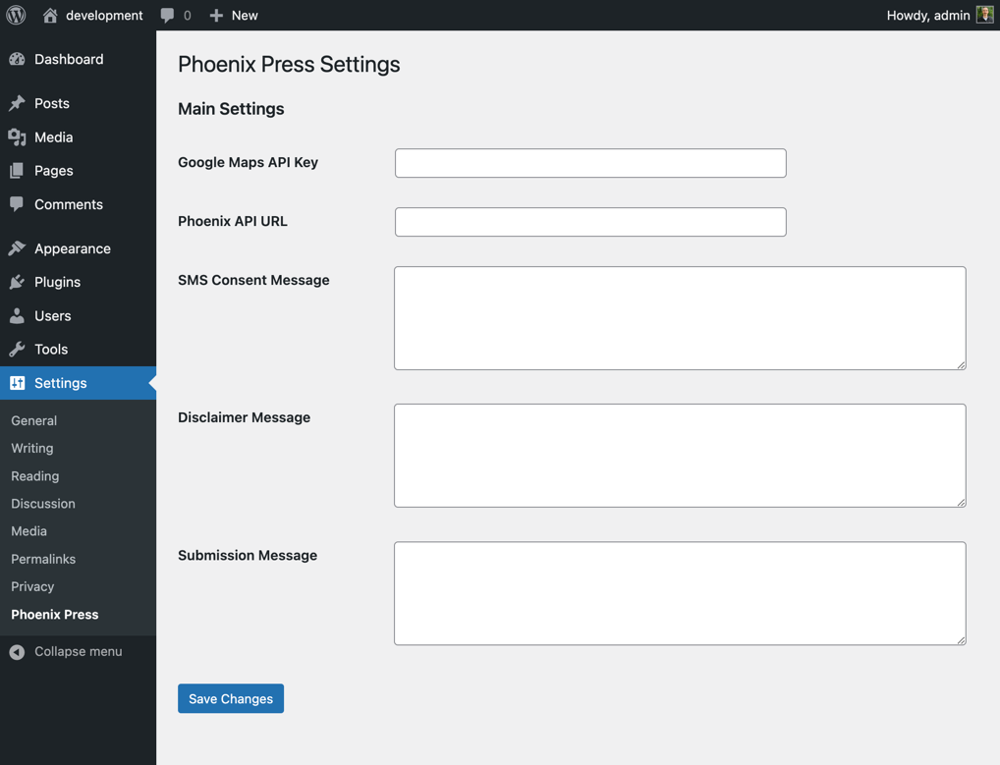

# PhoenixPress


### Description

Custom WordPress plugin for Phoenix CRM.

### Plugin Settings

Activating this plugin enables a few settings in the WordPress admin area under `Settings`. These settings are used to configure the plugin and are stored in the WordPress database.

- Google Maps API Key
- Phoenix API URL
- SMS Consent Message
- Disclaimer Message
- Submission Message

*Note: If the plugin is deactivated and removed, the plugin settings will remain. However, for a fresh install of WordPress these settings will need to be configured accordingly.*




### Releases

Check Releases page for the latest version of the plugin.

### Contributing

#### Prerequisites
- `composer` and `npm` installed on your system.
- `PHP` version 7.4.3 or higher.

#### Steps
1. Clone the repository to your local WordPress install in the `wp-content/plugins` directory:
   ```sh
   git clone https://github.com/anthonycoffey/phoenix-press.git
   cd phoenix-press
   ```

2. Move the Makefile to parent directory, and install dependencies:
   ```sh
   mv Makefile ..
   cd ..
   make install
   ```

3. Build the project:
   ```sh
   make build
   ```

4. Start the development server:
   ```sh
   make start
   ```

#### Available Commands

1. **Install Dependencies**
   ```sh
   make install
   ```
   This command installs PHP dependencies using Composer and JavaScript dependencies using npm.

2. **Start the Development Server**
   ```sh
   make start
   ```
   This command starts the development server using npm.

3. **Build the Project**
   ```sh
   make build
   ```
   This command builds the project using npm.


#### composer.json for parent `plugins` directory

In the parent `plugins` directory, you will need a `composer.json` file. This file is used to manage dependencies for the WordPress plugins. When you run `composer install`, Composer will install the dependencies listed in this file.

Create a `composer.json` file in the parent `plugins` directory, and paste the following contents:


```JSON
{
   "name": "phoenix/press",
   "type": "wordpress-plugin",
   "require-dev": {
      "10up/wp_mock": "^1.0"
   },
   "require": {
      "php": "^7.4.3 || ^8"
   },
   "scripts": {
      "test": "composer test:unit",
      "test:unit": "phpunit -c phpunit.xml",
      "fixes": "phpcbf php/ && phpcbf tests/"
   }
}
```